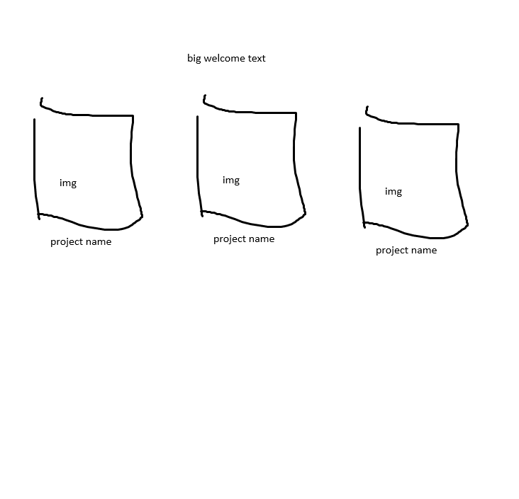

# Feature: Home Page

## Goal

implement `index.html`

## Designs

## Work

- minimalist layout
- centered `<h1>` for a decently large welcome text
- `<section>` -> `<article>` -> `<a>` -> `` with project names under the images for that link to other projects.
  - layed out using grid
  - around 3 projects per row
- hovering over an image makes it zoom in but the dimensions stays the same

## Deliverables

- It will have colours at the end
