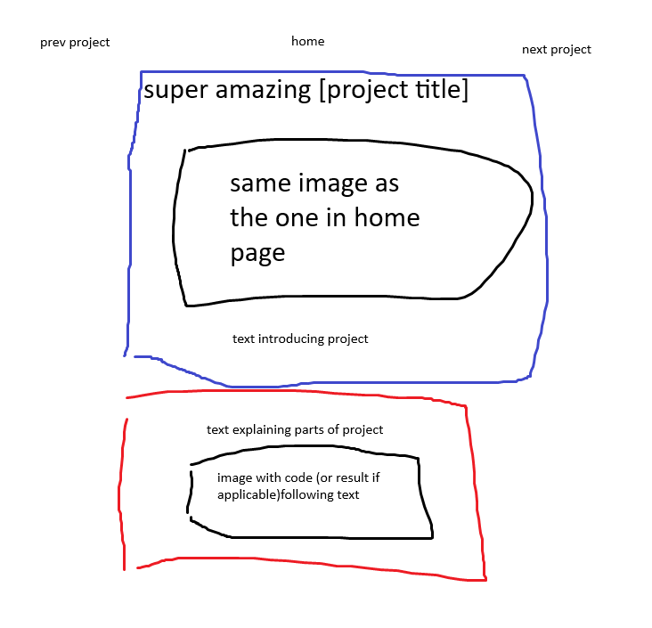

# Feature: Project Details

## Goal

implement `index.html`

## Designs

## Work

- `<a>` with links to previous proj, home, and next project
- Intro section (blue box):
  - Project title
  - Image of project in action
  - Wall of text explaining project
- inside `article` (red box):
  - paragraph explaining stuff such as challenges or implementation
  - relevant image

## Deliverables

- When it's done, it'll have colours
- The links might also be at the bottom if the pages get longer than expected
